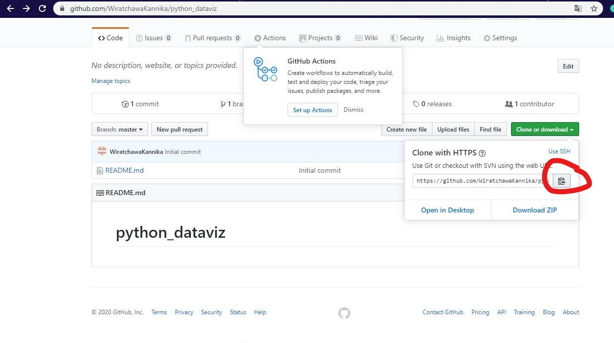
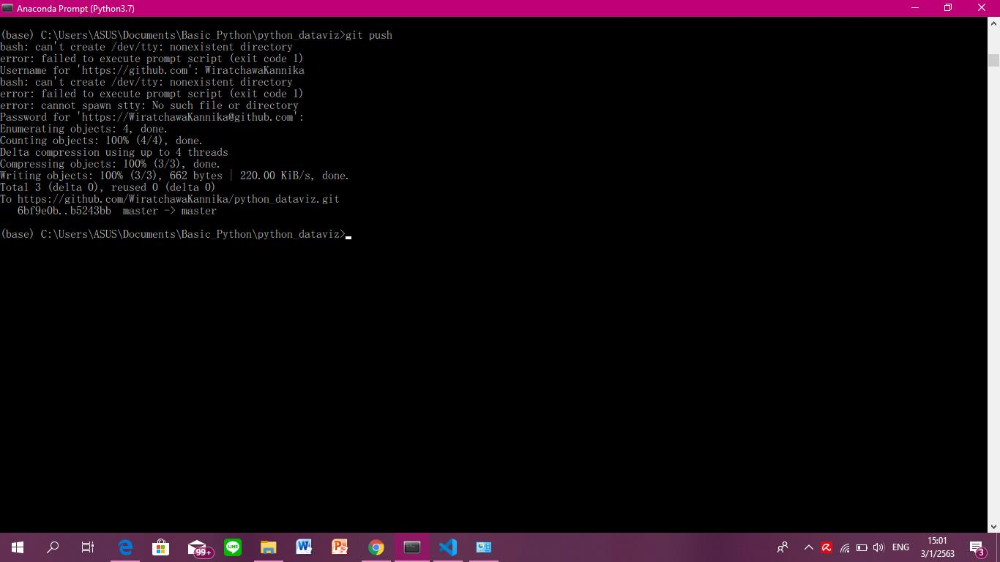
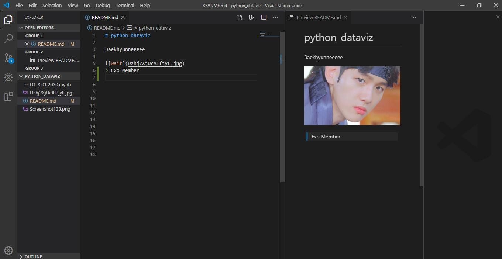

# Homework 1

1. วิธีติดตั้ง Miniconda 3.7.4
2.	วิธีการใช้งาน Colab
3.	วิธีการใช้งาน GitHub

เริ่มต้นด้วย 
## 1. วิธีการติดตั้ง Python 3.7 Miniconda 3 Windows 64-bit 
> ให้เข้าไปที่ www.Google.com พิมพ์คำว่า Miniconda จากนั้นให้เลือกที่ผลการค้นหาที่ปรากฏอันดับแรก

เมื่อกดเข้าไปจะพบกับหน้า Home page ที่มีให้เลือกติดตั้ง Miniconda ที่มีทั้งสำหรับผู้ใช้  Windows,  MacOSX, และ Linux ซึ่งมี version Python 2.7 และ 3.7 สำหรับคอมพิวเตอร์ที่เป็นระบบ Windows 64-bit Operating system ให้เลือกติดตั้ง Version Python 3.7  Miniconda3 Windows 64-bit ตามนี้

> เมื่อคลิ้กไปแล้ว จะได้ไฟล์ที่โหลดเป็น .exe ดังภาพ จากนั้นทำการกด RUN ได้เลย

 > กด Next ไปเลย

>กดไปที่ I  Agree

>เลือก Just Me แล้วกด Next ได้เลย

>โปรแกรมจะถามว่า ให้เลือกเก็บไว้ที่ไหนในคอมพิวเตอร์ หากต้องการเปลี่ยนที่จัดเก็บให้คลิ้กที่ Browse เพื่อเปลี่ยนที่จัดเก็บโปรแกรมได้เลย หลังจากนั้นให้กด Next ต่อไป

>กด Install ให้ติดตั้ง Miniconda34.7.12(64 Bit) ได้เลย

>รอจนกว่าโปรแกรมโหลดเสร็จให้สีเขียวเต็มหลอด แล้วก็กด Next ต่อไปได้

>เมื่อ Download  เสร็จสิ้นแล้ว ให้กดเสร็จสิ้น(Finish)ก็ติดตั้งเสร็จเรียบร้อย
ให้ไปกดที่ Start และเลือกกด Anaconda Prompt(Python 3.7) ให้คลิ้กเปิดโปรแกรมขึ้นมา

### ขั้นตอนที่ 1  
คือ ตรวจสอบว่าโปรแกรมที่ติดตั้งนั้นเป็น Python Version ไหน ให้ใช้คำสั่ง “Python” 
แล้วกด ENTER โปรแกรมจะแสดงรายละเอียดต่างๆสำหรับ Version ที่ติดตั้ง คือบอกว่าเป็น Python 3.7.4

### ขั้นตอนที่ 2 
คือ การเปลี่ยนที่เก็บงาน หรือเปลี่ยนไฟล์ที่ใช้เก็บงานต่างๆที่ทำลงในโฟลเดอร์ที่กำหนด 

### ขั้นตอนที่ 3 
คือ ติดตั้ง Matplotlib ซึ่งเป็นโปรแกรมที่เอาไว้สำหรับสร้างกราฟต่างๆในการใช้ Python ซึ่งเป็น Function ที่ขาดไม่ได้เลยสำหรับการใช้งานเรื่อง Data ติดตั้งโดยใช้คำสั่ง “Conda install Matplotlib” แล้วกด ENTER 

>จากนั้น ระบบจะทำการติดตั้ง Function Matplotlib ให้ แต่จะถามว่า Proceed([Y]/n)? ให้กด Y แล้ว ENTER และเสร็จสิ้นกระบวนการติดตั้ง

### ขั้นตอนที่ 4 
ติดตั้ง Jupyter Notebook เอาไว้สำหรับเขียน Code เพื่อ RUN คำสั่งของ Python ในการติดตั้งโปรแกรมให้เขียนว่า “conda install jupyter”

> ระบบจะทำการติดตั้ง Jupyter notebook  ให้ แต่จะถามว่า Proceed([Y]/n)? ให้กด Y แล้ว ENTER และเสร็จสิ้นกระบวนการติดตั้ง

### ขั้นตอนที่ 5 
การใช้งาน Jupyter notebook ให้ใช้คำสั่งสำหรับเปิดบราวเซอร์การทำงานของ Jupyter ว่า “Jupyter notebook”

> แล้วโปรแกรมจะเปิดบราวเซอร์สำหรับการใช้งานภาษา Python ดังภาพ

> การสร้าง New notebook ให้กดที่ New >> เลือก Python3

>โปรแกรมที่แสดงหน้าพร้อมสำหรับการใช้งานภาษา Python 

>หากต้องการเปลี่ยนชื่อ notebook ใหดับเบิ้ลคลิ้กที่ Menu Bar >> พิมพ์ชื่อที่ต้องการเปลี่ยนแล้วกด Rename

>การทดสอบใช้งานคำสั่งภาษา Python ใน Jupyter notebook

- ข้อดีของการใช้งานภาษา  Python บน Jupyter notebook ก็คือสามารถใช้งานได้โดยไม่ต้องเชื่อมต่อกับอินเทอร์เนต 
- ข้อเสีย คือ จะต้องติดตั้งโปรแกรมลงคอมพิวเตอร์ก่อนใช้งานทุกครั้ง

ต่อไป 
## 2. วิธีการใช้งาน Google Colab       
Google Colab คือ Jupyter note book ที่รันอยู่บนคลาวด์ เพื่อใช้ในการจัดเก็บตัวโค้ดเท่านั้น โดยมีภาษา Python เป็นภาษาหลักที่ใช้เขียนและรันงานบนเว็บ Colab นี้
### ขั้นตอนที่ 1 
ให้เข้าไปที่ https://www.google.com พิมพ์คำว่า Google Colab เลือกเข้าไปที่ผลการค้นหาอันดับแรกที่ปรากฏขึ้นมา แต่ให้เข้าระบบบัญชีของ Gmail เอาไว้ก่อน เพื่อเป็นการเข้าสู่ระบบ

> เมื่อคลิ้กเข้าไปจะพบว่า มีหน้าต่างที่แสดงไฟล์งานต่างๆที่เราจัดเก็บเอาไว้เป็นโค้ดบนระบบคลาวด์ สำหรับผู้ที่เคยทำงานใน Colab มาก่อน แต่ถ้าหากผู้ที่ใช้งานใหม่ หน้าต่างจะแสดงไฟล์ที่ชื่อว่า Welcome to Collaboratory เท่านั้น 

### ขั้นตอนที่ 2 
หากต้องการสร้าง Notebook ใหม่ ให้กดที่คำว่า New Python3 Notebook

> หลังจากกดคำว่า New Python3 Notebook แล้วจะปรากฏ Notebook ใหม่ที่ให้เขียนโค้ดและรันภาษา Python ในนั้นได้

### ขั้นตอนที่ 3 
การ Download ไฟล์งานเมื่อทำการเขียนโค้ดหรือรันเสร็จเรียบร้อย ให้กดที่ File > Download .ipynb ซึ่งแนะนำให้ทำการโหลดเพียงนามสกุลไฟล์เป็น ipynb เท่านั้น

- ข้อดีของการใช้งาน Google Colab คือ ไม่จำเป็นต้องติดตั้งโปรแกรมใดๆก่อนใช้งาน ซึ่งทุกคนสามารถใช้งานได้ เพียงแค่มีบัญชี Google Drive
- ข้อเสีย คือ ไม่สามารถใช้งานแบบออฟไลน์ได้ จะต้องเชื่อมต่ออินเทอร์เนตในการใช้งานตลอดเวลา

และสุดท้ายคือ 
## 3.วิธีการใช้งาน GitHub
GitHub คือ website Git (version control repository) ที่อยู่บน สามารถเข้าถึงข้อมูลและจัดการไปผ่าน web โดยไม่ต้องเสียเงิน หรือลงทุกตั้ง server เพื่อติดตั้ง Git เอง แต่ code project ทั้งหมดจะถูกแจกจ่ายให้คนอื่นๆสามารถเห็นได้ด้วย
### ขั้นตอนที่ 1 
การสมัครและสร้าง GitHub Account 
ให้เข้าไปที่ https://www.google.com พิมพ์คำว่า Github เลือกเข้าไปที่ผลการค้นหาที่มีที่อยู่เว็บไซต์ชื่อ https://github.com ให้คลิ้กเข้าไปที่หน้า Homepage ของเว็บไซต์

> คลิ้กที่ Sign up เพื่อสร้าง Account ของตนเอง

> จะปรากฏหน้าจอดังนี้ ให้กรอกรายละเอียดต่างๆเพื่อสร้าง Account ใหม่

> เมื่อทำการ Create เรียบร้อยแล้ว ทางระบบจะส่ง E-mail ไปที่กล่องข้อความให้เข้าไปกดยืนยัน E-mail ในทันที

> หลังจากนั้นระบบจะให้เราเข้าไปสร้างชื่อไฟล์งาน Project โดยในที่นี้ตั้งชื่อว่า python_dataviz จากนั้นคลิ้กคำว่า Create repository จึงเป็นอันสร้าง Account เสร็จสิ้น

### ขั้นตอนที่ 2 
Download โปรแกรม visual studio code ใช้สำหรับแก้ไขซอร์สโค้ด ควบคุม Git ในตัวและ GitHub เน้นไวยากรณ์ และเติมโค้ดอัจฉริยะสำหรับทำงานร่วมกับ Github
ให้เข้าไปที่ https://www.google.com พิมพ์คำว่า visual studio code เลือกเข้าไปที่ผลการค้นหาที่ปรากฏขึ้นอันดับแรก ให้คลิ้กเข้าไปที่หน้า Homepage ของเว็บไซต์ กดเพื่อ Download for Windows

> เลือก Windows  สำหรับ 64-bit

> เมื่อกด Download จะได้ไฟล์นามสกุล .exe ให้กดรันโปรแกรมเลย

> เมื่อกดรันแล้วให้กด Next ต่อไปเรื่อยๆ รอให้หลอดสีเขียวเต็มคือ Download โปรแกรมเสร็จเรียบร้อยแล้ว

> เมื่อติดตั้งโปรแกรมเรียบร้อยแล้ว จะได้หน้าตาของโปรแกรมเป็นประมาณดังนี้ 

### ขั้นตอนที่ 3 
การเชื่อมต่อโปรเจคใน Github กับ Jupyter notebook และ visual studio code โดยใช้ Anaconda prompt ภาษา Python เริ่มต้นด้วยการติดตั้ง Function ในการใช้งานร่วมกับ Gitgub ใน Anacoda prompt install ใช้คำสั่ง `conda install -c anaconda git`

> กด Y ไปเลยในการติดตั้ง

> หลังจากนั้นให้ Copy URL จากเว็บไซต์ Gitgub ที่ได้สร้างชื่อไฟล์ไว้ที่ Account ของเราเอง

> เปิดโปรแกรม Anaconda prompt(3.7) ขึ้นมา แล้วนำ URL มาใช้สำหรับการเชื่อมต่อโปรเจคกับ Github โดยใช้คำสั่ง `git clone  ตามด้วย URL ที่ copy มาจาก Github `

> เมื่อเสร็จเรียบร้อยแล้วให้เปลี่ยนที่อยู่ในการจัดเก็บไฟล์ไว้ที่ repository ชื่อ Project  โดยในที่นี้ตั้งชื่อว่า python_dataviz โดยใช้คำสั่ง `cd python_dataviz`

### ขั้นตอนที่ 4 
การอัพโหลดงานขึ้นบนเว็บไซต์ github  อันดับแรกให้เช็คสถานะของไฟล์งานก่อนว่ามีงานใดบ้างยังไม่ได้อัพโหลดขึ้นไปที่เว็บไซต์ Github  โดยใช้คำสั่ง Git status

> ถ้าเป็นตัวหนังสือสีแดงนั้นคือ ยังไม่ได้ทำการอัพโหลดขึ้นเว็บไซต์ Github ให้เพิ่มไฟล์เข้าไป โดยใช้คำสั่ง `git add (ชื่อไฟล์)` แล้วกด ENTER

> จากนั้นใช้คำสั่ง `git commit –m "ชื่อคอมเม้นของงานเรา” ` เพื่อเป็นการเตือนว่า เมื่อแก้ไขงานแล้ว Version นี้ที่แก้ไขนั้นเป็น version ไหนแล้ว 

> เนื่องจากระบบไม่ทราบว่าใครเป็นคนทำ Folder ที่เราต้องการจะอัพโหลดขึ้นไป จึงต้องบอก E-mail และ User.name ที่ใช้ในการสร้าง Account บน Github

> จากนั้นใช้คำสั่ง `git push` สำหรับการนำไฟล์งานต่างๆอัพโหลดขึ้น Github โปรแกรมจะให้ใส่ Username และ password เพื่อการยืนยันตัวตนในการใช้งาน  Account บน Github

> หลังจากอัพโหลดเรียบร้อยแล้วให้กลับไปที่เว็บไซต์ Github และกดรีเฟรชใหม่ จะเห็นไฟล์ที่อัพขึ้นมาใหม่ นั่นคือเสร็จสิ้นกระบวนการ
### ขั้นตอนที่ 5 
การใช้ Visual Studio code ควบคู่ไปกับการทำงานบน Github เพื่อเขียน Markdown สำหรับอัพลงเว็บอีกครั้งหนึ่ง ในการจะไปที่การเขียน Markdown จะใช้คำสั่ง `code .` เว็บไซต์ที่ใช้ในการเรียนรู้วิธีเขียน Markdown ชื่อ "markdown cheat-sheet"

> โปรแกรมจะเชื่อมโยงไปที่ Visual Studio Code ให้โดยอัตโนมัติ

