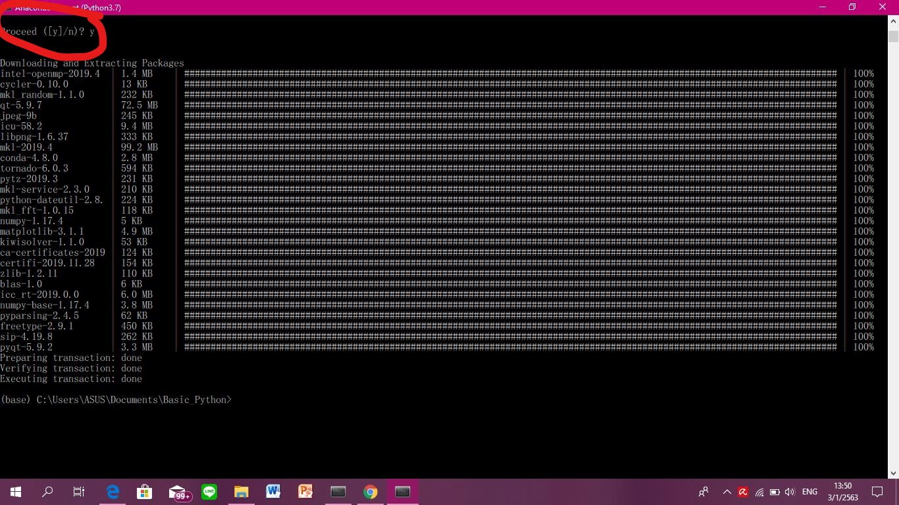

# Homework 1

1. วิธีติดตั้ง Miniconda 3.7.4
2.	วิธีการใช้งาน Colab
3.	วิธีการใช้งาน GitHub

เริ่มต้นด้วย 
## 1. วิธีการติดตั้ง Python 3.7 Miniconda 3 Windows 64-bit 
> ให้เข้าไปที่ www.Google.com พิมพ์คำว่า Miniconda จากนั้นให้เลือกที่ผลการค้นหาที่ปรากฏอันดับแรก

เมื่อกดเข้าไปจะพบกับหน้า Home page ที่มีให้เลือกติดตั้ง Miniconda ที่มีทั้งสำหรับผู้ใช้  Windows,  MacOSX, และ Linux ซึ่งมี version Python 2.7 และ 3.7 สำหรับคอมพิวเตอร์ที่เป็นระบบ Windows 64-bit Operating system ให้เลือกติดตั้ง Version Python 3.7  Miniconda3 Windows 64-bit ตามนี้

> เมื่อคลิ้กไปแล้ว จะได้ไฟล์ที่โหลดเป็น .exe ดังภาพ จากนั้นทำการกด RUN ได้เลย

 > กด Next ไปเลย

>กดไปที่ I  Agree

>เลือก Just Me แล้วกด Next ได้เลย

>โปรแกรมจะถามว่า ให้เลือกเก็บไว้ที่ไหนในคอมพิวเตอร์ หากต้องการเปลี่ยนที่จัดเก็บให้คลิ้กที่ Browse เพื่อเปลี่ยนที่จัดเก็บโปรแกรมได้เลย หลังจากนั้นให้กด Next ต่อไป

>กด Install ให้ติดตั้ง Miniconda34.7.12(64 Bit) ได้เลย

>รอจนกว่าโปรแกรมโหลดเสร็จให้สีเขียวเต็มหลอด แล้วก็กด Next ต่อไปได้

>เมื่อ Download  เสร็จสิ้นแล้ว ให้กดเสร็จสิ้น(Finish)ก็ติดตั้งเสร็จเรียบร้อย
ให้ไปกดที่ Start และเลือกกด Anaconda Prompt(Python 3.7) ให้คลิ้กเปิดโปรแกรมขึ้นมา

### ขั้นตอนที่ 1  
คือ ตรวจสอบว่าโปรแกรมที่ติดตั้งนั้นเป็น Python Version ไหน ให้ใช้คำสั่ง “Python” 
แล้วกด ENTER โปรแกรมจะแสดงรายละเอียดต่างๆสำหรับ Version ที่ติดตั้ง คือบอกว่าเป็น Python 3.7.4

### ขั้นตอนที่ 2 
คือ การเปลี่ยนที่เก็บงาน หรือเปลี่ยนไฟล์ที่ใช้เก็บงานต่างๆที่ทำลงในโฟลเดอร์ที่กำหนด 

### ขั้นตอนที่ 3 
คือ ติดตั้ง Matplotlib ซึ่งเป็นโปรแกรมที่เอาไว้สำหรับสร้างกราฟต่างๆในการใช้ Python ซึ่งเป็น Function ที่ขาดไม่ได้เลยสำหรับการใช้งานเรื่อง Data ติดตั้งโดยใช้คำสั่ง “Conda install Matplotlib” แล้วกด ENTER 

>จากนั้น ระบบจะทำการติดตั้ง Function Matplotlib ให้ แต่จะถามว่า Proceed([Y]/n)? ให้กด Y แล้ว ENTER และเสร็จสิ้นกระบวนการติดตั้ง

### ขั้นตอนที่ 4 
ติดตั้ง Jupyter Notebook เอาไว้สำหรับเขียน Code เพื่อ RUN คำสั่งของ Python ในการติดตั้งโปรแกรมให้เขียนว่า “conda install jupyter”

> ระบบจะทำการติดตั้ง Jupyter notebook  ให้ แต่จะถามว่า Proceed([Y]/n)? ให้กด Y แล้ว ENTER และเสร็จสิ้นกระบวนการติดตั้ง

### ขั้นตอนที่ 5 
การใช้งาน Jupyter notebook ให้ใช้คำสั่งสำหรับเปิดบราวเซอร์การทำงานของ Jupyter ว่า “Jupyter notebook”

> แล้วโปรแกรมจะเปิดบราวเซอร์สำหรับการใช้งานภาษา Python ดังภาพ

> การสร้าง New notebook ให้กดที่ New >> เลือก Python3

>โปรแกรมที่แสดงหน้าพร้อมสำหรับการใช้งานภาษา Python 

>หากต้องการเปลี่ยนชื่อ notebook ใหดับเบิ้ลคลิ้กที่ Menu Bar >> พิมพ์ชื่อที่ต้องการเปลี่ยนแล้วกด Rename

>การทดสอบใช้งานคำสั่งภาษา Python ใน Jupyter notebook

- ข้อดีของการใช้งานภาษา  Python บน Jupyter notebook ก็คือสามารถใช้งานได้โดยไม่ต้องเชื่อมต่อกับอินเทอร์เนต 
- ข้อเสีย คือ จะต้องติดตั้งโปรแกรมลงคอมพิวเตอร์ก่อนใช้งานทุกครั้ง

